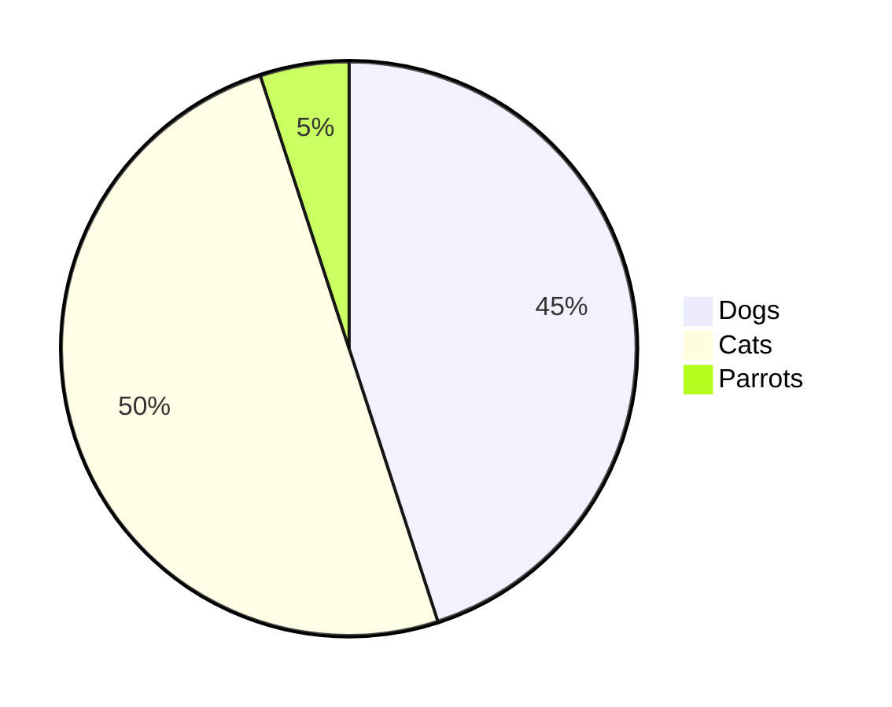

<div align="center">

# Readme Markdown Syntax Guide

☙◦
 
◦❧

</div>

**Markdown is a simple text formatting tool, widely used on platforms such as GitHub, GitLab, and Bitbucket. In repositories, the readme.md file serves as a file descriptor, offering essential project details.**

It’s commonly applied in Gists, comments, and files with .md or .markdown extensions. Markdown is also popular for content writing on websites and blogs, as well as for creating documentation and installation guides within project directories.


## Contents

1. [Headings](#1--headings)
   - <samp> H1 to H6 tags </samp>  
2. [Text styles](#2--text-styles)
   - <samp> Bold ○ Italic ○ Strikethrough ○ Underlined ○ Subscript ○ Superscript ○ and more.. </samp>  
3. [Lists](#3--lists)
   - <samp> Ordered ○ Unordered ○ </samp>  
4. [Links](#4--links)
   - <samp> Auto link ○ Link Label ○ Hover ○ Repository Links ○ Footnote ○ and more.. </samp>  
5. [Images](#5--images)
   - <samp> Basic tags ○ Image Embed element ○ GIF ○ Icons ○ Image with click action ○ </samp>  
6. [Alignments](#6--alignments)
   - <samp> Text Alignments ○ Image Alignments ○ </samp>  
7. [Code Block](#7--code-block)
   - <samp> Basic styles ○ Fenced code blocks ○ Diff Code block ○ </samp>  
8. [Text Decoration](#8--text-decoration)
   - <samp> Text Highlighting ○ Emoji ○ Blockquotes ○ Multi-line text ○ Anchor ○ Comments ○ and more.. </samp>  
9. [Line Settings](#9--line-settings)
   - <samp> Horizontal Line ○ Line break ○ </samp>  
10. [Mathematical Expressions](#10--mathematical-expressions)
    - <samp> Inline expressions ○ Block Expressions ○ </samp>  
11. [View components](#11--view-components)
    - <samp> CheckBox ○ Pie Chart ○ Badges ○ Buttons ○ </samp>  
12. [Markdown Alerts](#12--markdown-alerts)
    - <samp> NOTE ○ TIP ○ IMPORTANT ○ WARNING ○ CAUTION ○ </samp>  
13. [Tables](#13--tables)
    - <samp> Basic Table types ○ Table Alignment ○ Multi-line data ○ Nested Table ○ Table Styling ○  </samp>  

<br>  

___

<!-- ------------------------------------------------------------------ -->
<!-- -------------------------| 1 | Headings |-|-------------------------- -->
<!-- ------------------------------------------------------------------ -->

# 1 | Headings

`Preview :`

# H1
## H2
### H3
#### H4
##### H5
###### H6

<br>

` Syntax : `

```git
# H1
## H2
### H3
#### H4
##### H5
###### H6
```

Alternative ways
```md
<h1>H1</h1>
<h2>H2</h2>
<h3>H3</h3>
<h4>H4</h4>
<h5>H5</h5>
<h6>H6</h6>
```

```md
H1
=
H2
-
```

<br>  

___

___

<br>

<!-- ------------------------------------------------------------------ -->
<!-- -------------------------| 2 | Text styles |-|-------------------------- -->
<!-- ------------------------------------------------------------------ -->

# 2 | Text styles
<!-- -------------------------- Bold -------------------------- -->
## 2.1 ‣ Bold

`Preview :`

**Bold Text Style**  

<br>

` Syntax : `

```md
**Bold Text Style**
```

Alternative ways to **bold text** 

```md
Alternative ways to __bold text__
Alternative ways to <strong>bold text</strong>
```
<br>

<!-- -------------------------- Italic -------------------------- -->

## 2.2 ‣ Italic

`Preview :`

*Italic Text Style*  

<br>

` Syntax : `

```md
*Italic Text Style*
```

Alternative ways to *italic text*   

```md
Alternative ways to _italic text_
Alternative ways to <em>italic text</em>
```
<br>
<!-- -------------------------- Bold and Italic -------------------------- -->

## 2.3 ‣ Bold and Italic

`Preview :`

***Bold and Italic Text Style***

<br>

` Syntax : `

```md
***Bold and Italic Text Style***
```

Alternative ways to **_bold and italic text_**  

```md
Alternative ways to **_bold and italic text_** 
Alternative ways to <strong><em>bold and italic text</em></strong>
```
<br>
<!-- -------------------------- Strikethrough -------------------------- -->

## 2.4 ‣ Strikethrough

`Preview :`

~~Strikethrough Text~~

<br>

` Syntax : `

```md
~~Strikethrough Text~~
```

Alternative ways to <strike>strikethrough text</strike>


```md
Alternative ways to <strike>strikethrough text</strike>
```
<br>
<!-- -------------------------- Bold, Italic and Strikethrough -------------------------- -->

## 2.5 ‣ Bold, Italic and Strikethrough

`Preview :`

***~~Bold, Italic and Strikethrough Text~~***

<br>

` Syntax : `

```md
***~~Bold, Italic and Strikethrough Text~~***
```
<br>
<!-- -------------------------- Underlined -------------------------- -->

## 2.6 ‣ Underlined

`Preview :`

<ins>Underlined Text Style</ins>

<br>

` Syntax : `

```md
<ins>Underlined Text Style</ins>
```
<br>
<!-- -------------------------- Boxed -------------------------- -->

## 2.7 ‣ Boxed

`Preview :`

<table><tr><td>Boxed Text Style</td></tr></table>

<br>

` Syntax : `

```md
<table><tr><td>Boxed Text Style</td></tr></table>
```
<br>
<!-- -------------------------- Subscript -------------------------- -->

## 2.8 ‣ Subscript

`Preview :`

This is the   <sub>Subscript</sub>   text style  
log<sub>2</sub>(x)

<br>

` Syntax : `

```md
This is the <sub>Subscript</sub> text style  
log<sub>2</sub>(x)
```

<br>
<!-- -------------------------- Superscript -------------------------- -->

## 2.9 ‣ Superscript

`Preview :`

This is the   <sup>Superscript</sup>   text style  
2 <sup>3</sup> = 8

<br>

` Syntax : `

```md
This is the <sup>Superscript</sup> text style  
2 <sup>3</sup> = 8
```
<br>
<!-- -------------------------- Monospaced -------------------------- -->

## 2.10 ‣ Monospaced

`Preview :`

This is the normal text style  
<samp>This is the Monospaced text style</samp> 

<br>

` Syntax : `

```md
<samp>This is the Monospaced text style</samp> 
```

<br>  

___

___

<br>

<!-- ------------------------------------------------------------------ -->
<!-- -------------------------| 3 | Lists |-|-------------------------- -->
<!-- ------------------------------------------------------------------ -->

# 3 | Lists

<!-- -------------------------- Ordered -------------------------- -->

## 3.1 ‣ Ordered 

`Preview :`

1. First level - Item one
2. First level - Item two
3. First level - Item three

<br>

` Syntax : `

```md
1. First level - Item one
2. First level - Item two
3. First level - Item three
```
<br>

##
### Multi level

`Preview :`

1. First level
    1. Second level
        1. Third level
            - Fourth level
        2. Third level
            - Fourth level
     2. Second level  
2. First level
    1. Second level


<br>

` Syntax : `


```md
1. First level
    1. Second level
        1. Third level
            - Fourth level
        2. Third level
            - Fourth level
     2. Second level  
2. First level
    1. Second level
```
<br>
<!-- -------------------------- Unordered -------------------------- -->

## 3.2 ‣ Unordered

`Preview :`

- Item one
- Item two

<br>

` Syntax : `

```md
- Item one
- Item two
```

Alternative ways 


```md
* Item one
* Item two

+ Item one
+ Item two
```
<br>

##
### Multi level

`Preview :`

- First level
  - Second level
    - Third level
      - Fourth level
- First level
  - Second level
 
<br>

` Syntax : `

```md
- First level
  - Second level
    - Third level
      - Fourth level
- First level
  - Second level
```


<br>  

___

___

<br>

<!-- ------------------------------------------------------------------ -->
<!-- -------------------------| 4 | Links |-|-------------------------- -->
<!-- ------------------------------------------------------------------ -->

# 4 | Links

<!-- -------------------------- Basic types -------------------------- -->

## 4.1 ‣ Basic Types

- Auto link <br>

`Preview :`

Web   : https://www.google.com

Email : example@example.com
 
<br>

` Syntax : `

```md
Web   : https://www.google.com
Email : example@example.com
```
<br>

#
- Enclosed link <> <br>

`Preview :`

GitHub : Let's build from here · <https://github.com>
 
<br>

` Syntax : `

```md
GitHub : Let's build from here · <https://github.com>
```

<br>
<!-- -------------------------- Link Label -------------------------- -->

## 4.2 ‣ Link Label 

`Preview :`

[GitHub](https://github.com) : Let's build from here <br>
Hi, [sign in](https://github.com/login) to GitHub
 
<br>

` Syntax : []()`

```md
[GitHub](https://github.com) : Let's build from here
Hi, [sign in](https://github.com/login) to GitHub
```

<br>

## 4.3 ‣ Hover 

`Preview :`

GitHub : [Login](https://github.com/login "Sign in to GitHub! Click here") : Let's build from here <br>
 
<br>

` Syntax : [ ]( | "")`

```md
GitHub : [Login](https://github.com/login "Sign in to GitHub! Click here") : Let's build from here
```
<br>


## 4.4 ‣ Repository Links

`Preview :`

[Example Document](/src/example.md)

<br>

` Syntax : ( ./ )`

```md
[Example Document](/src/example.md)
```

#

`Preview :`

[README Document](README.md)

<br>

` Syntax : ( ./ )`

```md
[README Document](README.md)
```


#

`Preview :`

[SRC Directory](./src)

<br>

` Syntax : ( ./ )`

```md
[SRC Directory](./src)
```

<br>
<br>

## 4.5 ‣ Footnote 

`Preview :`

Learn advanced formatting features by creating a README for your GitHub profile [^1].  
Github markdown cheat sheet [^2].

[^1]: Reference : https://docs.github.com/en/get-started/writing-on-github/getting-started-with-writing-and-formatting-on-github/quickstart-for-writing-on-github
[^2]: Reference : https://dev.to/sameerkatija/github-markdown-cheat-sheet-everything-you-need-to-know-to-write-readme-md-2eca

<br>

` Syntax : [ ^1 ]`

```md
Learn advanced formatting features by creating a README for your GitHub profile [^1].  
Github markdown cheat sheet [^2].

[^1]: Reference : https://docs.github.com/en/get-started/writing-on-github/getting-started-with-writing-and-formatting-on-github/quickstart-for-writing-on-github
[^2]: Reference : https://dev.to/sameerkatija/github-markdown-cheat-sheet-everything-you-need-to-know-to-write-readme-md-2eca
```
<br>

## 4.6 ‣ Reference 

`Preview :`

[GitHub : Let's build from here][github-link] <br>
[Hello there, sign in to GitHub][Login link]
<br>

[github-link]: https://github.com
[Login link]: https://github.com/login


<br>

` Syntax : [ ][ ]`

```md
[GitHub : Let's build from here][github-link]
[Hello there, sign in to GitHub][Login link]

[github-link]: https://github.com
[Login link]: https://github.com/login
```


<br>  

___

___

<br>

<!-- ------------------------------------------------------------------ -->
<!-- -------------------------| 5 | Images |-|-------------------------- -->
<!-- ------------------------------------------------------------------ -->

# 5 | Images

## 5.1 ‣ Basic Image 
<kbd> !\[Alternative-text](URL "Title-text") </kbd>

*Alternative text and title text are optional*
##

`Preview :`


<br>

` Syntax : `

```md

```


## 5.2 ‣ Image Embed element : \

### ‣ Image

`Preview :`


<br>

` Syntax : `

```md

```
<br>

##

### ‣ GIF

`Preview :`


<br>

` Syntax : `

```md

```

<br>

##

### ‣ Icons

`Preview :`


<br>

` Syntax : `

```md


```

<br>

## 5.3 ‣ Image with click action

`Preview :`

[](https://github.com)

<br>

` Syntax : `

```md
[](https://github.com)
```

<br>
<br>
<br>


`Preview :`

<a 
  href='https://github.com' 
  target='_blank'> 
   
</a>

<br>

` Syntax : `

```md
<a 
  href='https://github.com' 
  target='_blank'> 
   
</a>
```


<br>  

___

___

<br>

<!-- ------------------------------------------------------------------ -->
<!-- -------------------------| 6 | Alignments |-|-------------------------- -->
<!-- ------------------------------------------------------------------ -->

# 6 | Alignments

## 6.1 ‣ Text Alignments


`Preview :`

<h3 align="left"> Heading Left </h3>
<h3 align="center"> Heading Center </h3>
<h3 align="right"> Heading Right </h3>

<br>

` Syntax : `

```md
<h3 align="left"> Heading Left </h3>
<h3 align="center"> Heading Center </h3>
<h3 align="right"> Heading Right </h3>
```

## 6.2 ‣ Image Alignments

### Left

`Preview :`

<p align="left">

</p>

<br>

` Syntax : `

```md
<p align="left">

</p>
```
##

### Center

`Preview :`

<p align="center">

</p>

<br>

` Syntax : `

```md
<p align="center">

</p>
```
##

### Right

`Preview :`

<p align="right">

</p>

<br>

` Syntax : `

```md
<p align="right">

</p>
```
##

### Multiple Images

`Preview :`

<p align="center">


</p>

<br>

` Syntax : `


```md
<p align="center">


</p>
```

<br>
<br>  

___

___

<br>

<!-- ------------------------------------------------------------------ -->
<!-- -------------------------| 7 | Code Block |-|-------------------------- -->
<!-- ------------------------------------------------------------------ -->


# 7 | Code Block

### 7.1 ‣ Basic style
You can create code blocks by placing triple backticks ``` before and after the code block. 

`Preview :`

```
this is an example of code.
```

<br>

` Syntax : `

```
    ```
    this is an example of code.
    ```
```

##
### 7.2 ‣ Fenced code blocks
In GitHub Flavored Markdown (GFM), you can create code blocks by wrapping your code with three backticks, avoiding the need for leading spaces. <br>
You can also add an optional language identifier to enable syntax highlighting for your code.

` Syntax : Java`

````md
```java
public static void main(String[]args){} 
//Java Code
```
````

<br>

` Syntax : Javascript`

````md
```javascript
console.log('javascript')
//Javascipt code
```
````

<br>

` Syntax : Python`

````md
```python
print('python')
```
````

<br>

` Syntax : Json`

````md
```json
{
  "firstName": "A",
  "lastName": "B",
  "age": 18
}
```
````


##
### 7.3 ‣ Diff Code block

In version control, diff highlights changes in various colors. In GitHub Flavored Markdown (GFM), you can display:

- Green for additions (+)
- Red for deletions (-)
- Orange for changes (!)
- Gray for comments (#)
- Purple and bold for metadata (@@) <br>
    
Use the same syntax as fenced code blocks but specify diff after the three backticks.


`Preview :`

```diff
- Text Color Red
+ Text Color Green
! Text Color Orange
# Text Color Gray
@@ Text Color Purple And Bold @@
```

<br>

` Syntax : diff`

````md
```diff
- Text Color Red
+ Text Color Green
! Text Color Orange
# Text Color Gray
@@ Text Color Purple And Bold @@
```
````

##
### Recommendation > Use YAML : A Human-Friendly Data Serialization Language

` Syntax : YAML`

````md
```yaml
name: John Doe
location: New York, USA
origin: Canada
education: Bachelor's in Computer Science
occupation: Software Engineer
company: ***

```
````

<br>  

___

___

<br>

<!-- ------------------------------------------------------------------ -->
<!-- -------------------------| 8 | Text Decoration  |-|-------------------------- -->
<!-- ------------------------------------------------------------------ -->

# 8 | Text Decoration 

### 8.1 ‣ Text Highlighting

Using backticks( ` ) is a simple way to create tags for articles, such as <br>
<br>

*Preview :*


`GitHub` : Let's build from here - `any important text`

<br>

**Syntax :**


```git
`GitHub` : Let's build from here - `any important text`
```

##
### 8.2 ‣ Emoji

`Preview :and: Syntax`


🌳 🐻 🍯 🌺

You can easily add emojis by placing them directly in your text, like this: 🌳 🐻 🍯 🌺

or you can use shortcode format


`Preview :`


:deciduous_tree: :bear: :honey_pot: :hibiscus:


` Syntax : `

```md
:deciduous_tree: :bear: :honey_pot: :hibiscus:
```


For a comprehensive list of all supported emojis on GitHub, check out the [Emoji Cheat Sheet](https://github.com/ikatyang/emoji-cheat-sheet/blob/master/README.md)

##
### 8.3 ‣ Quoting Text / Blockquotes >

`Preview :`

> This is a block quoted text

<br>

` Syntax : `

```git
> This is a block quoted text
```
<br>

**Difference**
<br>
<br>

`Preview :`

This is a normal text
> Block quoted text  

This is a normal text

<br>

` Syntax : `

```git
This is a normal text
> Block quoted text
This is a normal text
```

##
### 8.4 ‣ Multi-level blockquotes

`Preview :`

> First level
>> Second level
>>> Third level
>>>> Fourth level
>>>>> Fifth level

<br>

` Syntax : `

```md
> First level
>> Second level
>>> Third level
>>>> Fourth level
>>>>> Fifth level
```

##
### 8.5 ‣ Multi-line text

You can add either 2 spaces or 4 spaces at the end of a line before starting a new line to achieve an indented effect.

`Preview :`

First level  
Second level    
Third level  

<br>

` Syntax : `

```md
First level  
Second level    
Third level  
```


##
### 8.6 ‣ Anchor

Each title in GitHub Flavored Markdown (GFM) serves as an anchor, similar to an HTML anchor (#). For example:
#### NOTE : Keep in mind that all letters in the title are converted to lowercase.

`Preview :`

[Back to contents](#contents)


<br>

` Syntax : `

```md
[Back to contents](#contents)
```

##
### 8.7 ‣ Visible markdown characters
 
To make special characters visible in Markdown, you can escape them using a backslash (\\). Here are some common examples:

`Preview :`

\<br>


` Syntax : `

```md
\<br>
```

##
### 8.8 ‣ Comments in Markdown

You can add comments in Markdown using HTML-style comments:


` Syntax : `

```md
<!-- comment written in markdown -->
```

#### NOTE : These comments will be invisible when viewing the README file.


<br>  

___

___

<br>

<!-- ------------------------------------------------------------------ -->
<!-- -------------------------| 9 | Line Settings  |-|-------------------------- -->
<!-- ------------------------------------------------------------------ -->

# 9 | Line Settings


### 9.1 ‣ Horizontal Line

### ‣ Style 1

`Preview :`

#

<br>

` Syntax : `

```md
#
```

Alternative ways

```md
##
```
<br>

### ‣ Style 2

`Preview :` 

___

<br>

` Syntax : `

```md
___
```

Alternative ways

```md
***
```

```md
--- 
```

```md
<hr>
```


##
### 9.2 ‣ Break between lines \<br>

`Preview :`

This is a <br>normal text

<br>

` Syntax : `

```md
This is a <br>normal text
```


<br>  

___

___

<br>

<!-- ------------------------------------------------------------------ -->
<!-- -------------------------| 10 | Mathematical Expressions  |-|-------------------------- -->
<!-- ------------------------------------------------------------------ -->

# 10 | Mathematical Expressions

You can use LaTeX-style syntax to render math expressions in Markdown, allowing you to present mathematical content both inline (using `$` delimiters) and as blocks (using `$$` delimiters)

##
### 10.1 ‣ Inline expressions
To include a math expression inline, simply place the expression between two dollar ( `$` ) signs.  
Here’s a basic example:

$\sqrt{5x}+(25+x)^2$

Additionally, you can use the following expression to demonstrate inline math:
<br>

`Preview :`
<br>

This sentence uses `$` delimiters to show math inline:  
$\frac{2a+b}{c} = d$

<br>

` Syntax : `

```md
This sentence uses `$` delimiters to show math inline:  
$\frac{2a+b}{c} = d$
```
<br>

##
### 10.2 ‣ Block Expressions

To display a mathematical expression as a multiline block, start a new line and enclose the expression with two dollar symbols `$$`.  
This format is particularly useful for complex equations or when you want to emphasize the math content.

Here’s an example of a block expression:

`Preview :` 
<br>

$$\int_{a}^{b} f(x) \, dx = F(b) - F(a)$$

<br>

` Syntax : `

```md
$$\int_{a}^{b} f(x) \, dx = F(b) - F(a)$$
```


<br>  

___

___

<br>

<!-- ------------------------------------------------------------------ -->
<!-- -------------------------| 11 | View Components  |-|-------------------------- -->
<!-- ------------------------------------------------------------------ -->

# 11 | View Components

### 11.1 ‣ CheckBox

*Preview:* 
<br>

* [ ] Checkbox 1

* [x] Checkbox 2 Selected

* [ ] Checkbox 3

<br>

**Syntax:**
<br>

```md
* [ ] Checkbox 1

* [x] Checkbox 2 Selected

* [ ] Checkbox 3
```
<br>


##
### 11.2 ‣ Pie Chart

<br>

*Preview:* 
<br>



**Syntax:**
<br>

````md

````
<br>

<br>

##
### 11.3 ‣ Badges

To get dynamically generated GitHub stats on your READMEs, check out [GitHub Readme Stats](https://github.com/anuraghazra/github-readme-stats) !


*Preview:*

[](https://github.com/dizzcode/github-readme-stats)

**Syntax:**
<br>
**Change the `?username= value` to your GitHub username.**
````md
[](https://github.com/dizzcode/github-readme-stats)
````

#
*Preview:*
<br>  
[](https://github.com/dizzcode)

<br>  

**Syntax:**
<br>
**Change the `?username= value` to your GitHub username.**
````md
[](https://github.com/dizzcode)
````

<br>

##
### 11.4 ‣ Buttons

*Preview:* 

<kbd>[ GitHub Login ](https://github.com/login)</kbd>

**Syntax:**
<br>

```md
<kbd>[ GitHub Login ](https://github.com/login)</kbd>
```
#

*Preview:* 

<kbd>[<br>&nbsp;   🌘 GitHub Login ┈➤  &nbsp;<br><br>](https://github.com/login) </kbd>

**Syntax:**
<br>

```md
<kbd>[<br>&nbsp;   🌘 GitHub Login ┈➤  &nbsp;<br><br>](https://github.com/login) </kbd>
```


<br>  

___

___

<br>

<!-- ------------------------------------------------------------------ -->
<!-- -------------------------| 12 | Markdown Alerts  |-|-------------------------- -->
<!-- ------------------------------------------------------------------ -->

# 12 | Markdown Alerts

Alerts are special features in Markdown used to highlight important information.  
On GitHub, these alerts are shown with different colors and icons to help users quickly understand how important the content is.

##
### 12.1 ‣ NOTE

*Preview:* 

> [!NOTE]
> Essential details that users should not overlook, even when browsing quickly.

<br>

**Syntax:**

```md
> [!NOTE]
> Essential details that users should not overlook, even when browsing quickly.
```
<br>

##
### 12.2 ‣ TIP

*Preview:* 

> [!TIP]
> Additional advice to aid users in achieving better outcomes.

<br>

**Syntax:**

```md
> [!TIP]
> Additional advice to aid users in achieving better outcomes.
```
<br>

##
### 12.3 ‣ IMPORTANT

*Preview:* 

> [!IMPORTANT]
> Vital information required for users to attain success.

<br>

**Syntax:**

```md
> [!IMPORTANT]
> Vital information required for users to attain success.
```
<br>


##
### 12.4 ‣ WARNING

*Preview:* 

> [!WARNING]
> Urgent content that requires immediate user focus due to possible risks.

<br>

**Syntax:**

```md
> [!WARNING]
> Urgent content that requires immediate user focus due to possible risks.
```
<br>


##
### 12.5 ‣ CAUTION

*Preview:* 

> [!CAUTION]
> Possible negative outcomes resulting from an action.

<br>

**Syntax:**

```md
> [!CAUTION]
> Possible negative outcomes resulting from an action.
```
<br>


<br>  

___

___

<br>

<!-- ------------------------------------------------------------------ -->
<!-- -------------------------| 13 | Tables |-|-------------------------- -->
<!-- ------------------------------------------------------------------ -->

# 13 | Tables

### 13.1 ‣ Basic Table types

*Preview:* 
<br>  

|Header 1|Header 2|Header 3|
| --- | --- | --- |
| First  | Data | Row |
| Second | Data | Row |
| Third  | Data | Row |

**Syntax:**

```md
|Header 1|Header 2|Header 3|
| --- | --- | --- |
| First  | Data | Row |
| Second | Data | Row |
| Third  | Data | Row |
```

Alternative ways

```md
<table>
 <tr>
  <td width="33%">Header 1</td> 
  <td width="33%">Header 2</td>
  <td width="33%">Header 3</td>
 </tr>

 <tr>
   <td>First</td>   
   <td>Data</td>
   <td>Row</td>
 </tr>
</table>
```


##
### 13.2 ‣ Table Alignment

- `-`   Default 
- `:-`  Align Left  
- `:-:` Align Center
- `-:`  Align Right


*Preview:* 

| Default | Left  | Center | Right |
| - | :- | :-: | -: |
| 10000 | 10000 | 10000 | 10000 |
| 1000000000001 | 1000000000001 | 1000000000001 | 1000000000001 |
| 20002 | 20002 | 20002 | 20002 |

**Syntax:**

```md
| Default | Left  | Center | Right |
| - | :- | :-: | -: |
| 10000 | 10000 | 10000 | 10000 |
| 1000000000001 | 1000000000001 | 1000000000001 | 1000000000001 |
| 20002 | 20002 | 20002 | 20002 |
```

<br>

##
### 13.3 ‣ Multi-line data

*Preview:* 

|Header 1|Header 2|Header 3|
|---|---|---|
| Data 1 | Data 2 <br> Data 3 <br> Data 4 | Data 5 |

**Syntax:**

```md
|Header 1|Header 2|Header 3|
|---|---|---|
| Data 1 | Data 2 <br> Data 3 <br> Data 4 | Data 5 |
```

<br>

##
### 13.4 ‣ Nested Table

*Preview:* 

<table>
<tr>
<th>Header 1</th>
<th>Header 2</th>
</tr>
<tr>

<td>

| H 1 | H 2 |
|--|--|
| Data 1 | Data 2 |

</td><td>

| H 1 | H 2 | H 3 |
|--|--|--|
| Data 1 | Data 2 | Data 3 |

</td></tr> 
</table>

**Syntax:**

```md
<table>
<tr>
<th>Header 1</th>
<th>Header 2</th>
</tr>
<tr>

<td>

| H 1 | H 2 |
|--|--|
| Data 1 | Data 2 |

</td><td>

| H 1 | H 2 | H 3 |
|--|--|--|
| Data 1 | Data 2 | Data 3 |

</td></tr> 
</table>
```

<br>

##
### 13.5 ‣ Styling

*Preview:* 

<table>
<tr>
<th>Header 1</th>
<th>Header 2</th>
</tr>
<tr>
<td>
    
<pre>
    <h3 align="center"> This is a Cool Icon  </h3>

    

</pre>

</td>
<td>
    
<pre lang="js">
    console.log('Hello');
    console.log('World!');
    console.log('This is');
    console.log('JavaScript');
</pre>

</td>
</tr>
</table>


**Syntax:**

```md
<table>
<tr>
<th>Header 1</th>
<th>Header 2</th>
</tr>
<tr>
<td>
    
<pre>
    <h3 align="center"> This is a Cool Icon  </h3>

    

</pre>

</td>
<td>
    
<pre lang="js">
    console.log('Hello');
    console.log('World!');
    console.log('This is');
    console.log('JavaScript');
</pre>

</td>
</tr>
</table>
```

<br>
___
